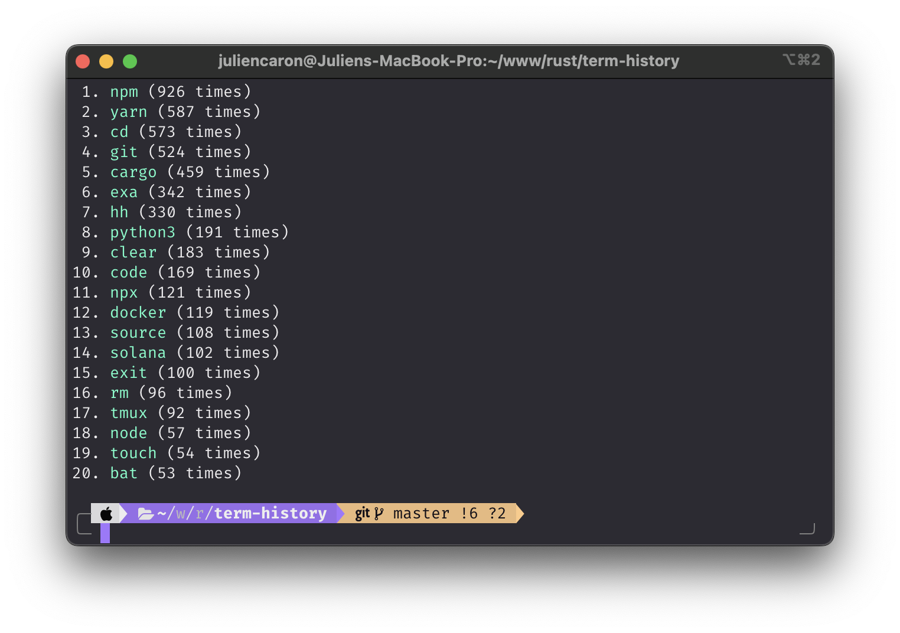

# term-history

Little CLI app that shows you which terminal programs you use most often.

It supports alias resolution for `zsh` shell.

## Usage

1. Get your history file path

```bash
echo $HISTFILE
```

2. Call the program with that file path as argument

```bash
cargo run <path/to/history/file>
```

3. Options

```bash
# Enable colors
cargo run $HISTFILE --colors

# Change head length (max visible lines)
cargo run $HISTFILE --head 10
```
